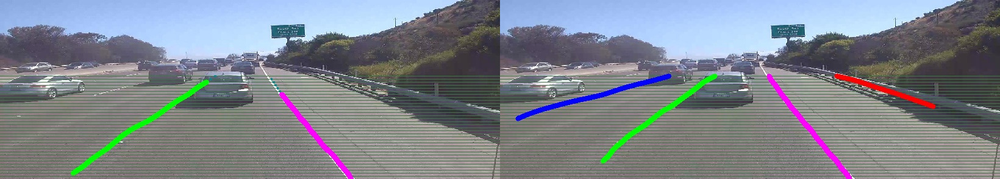

# LaneDetector

### Introduction
The purpose of Lane Detector is to take Swarm Image or Video and detect upto 4 lanes in the input; it then generates a suitable output (image or video) with the lanes marked. LaneDetector, finally, tells you for each frame (in a JSON file):

1. Total number of lanes
2. Which lane the car is in

LaneDetector, at its core, is Spatial Convolutional Neural Network (SCNN) developed by Xingang Pan. SCNN itself is based on ResNet.

### Future Improvements
- Extend to 8 lanes
- Detect type of lane marking as well (double yellow line, single white line etc.)
- Propagate information between frames
- Create docker container for SCNN
- Improve video generation (ffmpeg is bad)
- Train SCNN more on swarm images

### Requirements
1. CUDA enabled GPU (SCNN recommends 3Gigabyte GPU for testing and 4 12Gigabyte GPUs for training)
2. CUDA toolkit 9.2 or later
3. cuDNN 7.1.4 or later
4. Torch7 (install.sh provides an option for torch)
5. OpenCV 3.3 or later
6. Matlab R2014a or later

### Installation
1. Clone this repository
```shell
$ git clone https://github.com/carmeraco/LaneDetector.git
```

2. Run install.sh
```shell
$ cd LaneDetector
$ sh install.sh
```
Use the appropriate flags that you need

		a. "-t" to install torch

		b. "-d" to download the dataset from CULane

		c. "-w" to download the weigths file from S3

install.sh copies custom scripts from the Backup folder into their correct directories

3. Install the lane_detector module
```shell
$ python3 setup.py install
```
4. Download the pre-trained weights file either manually or by running `sh install.sh -w`

5. Configuration: you can configure the module either by pre setting environment variables, or by passing the configuration as arguments to the constructor. Use the `-h` flag for additional information
```
SCNN_SCNN if enabled, will run SCNN probability map generation
SCNN_VIDEO if enabled, will run video generation (prototype)
SCNN_DEBUG if enabled, will log the output of all files in the terminal
SCNN_CLEAN if enabled, will remove all temporary output files. This uses shutil.rmtree(), be careful :)
```

### Usage

#### API:

`python import_tester.py <ABSOLUTE-path-to-image/video> -flag1 -flag2 `

#### Example:
```python
#!/usr/bin/python
import argparse
from lane_detector import frame_list

parser = argparse.ArgumentParser()
parser.add_argument("source", help = "Path to video or image directory")
parser.add_argument("-e", "--environ", help = "USE Environment Variables instead", action = "store_true", default = False)
parser.add_argument("-s", "--scnn", help = "RUN SCNN probability map generation", action = "store_true", default = False)
parser.add_argument("-v", "--video", help = "RUN video generation", action = "store_true", default = False)
parser.add_argument("-d", "--debug", help = "RUN in debug mode (output displayed)", action = "store_true", default = False)
parser.add_argument("-c", "--clean", help = "REMOVE all generated folders and files", action = "store_true", default = False)
args = vars(parser.parse_args())

scnn_test = frame_list.SCNN(**args)
print(scnn_test.run_all())
```
The output is stored in `data.json` as well as printed out (if using the above sample). The json file looks like:
```python
[
    {
        "frame": 1,
        "lanes_count": 0,
        "current_lane": 0,
        "confidence": [
            "0.0052451747469604",
            "0.038813650608063",
            "0.027972972020507",
            "0.0028216277714819"
        ]
    },
    {
        "frame": 2,
        "lanes_count": 0,
        "current_lane": 0,
        "confidence": [
            "0.0025243507698178",
            "0.038077626377344",
            "0.030799916014075",
            "0.0047715208493173"
        ]
    },
    ...
    {
        "frame": 6,
        "lanes_count": 4,
        "current_lane": 2,
        "confidence": [
            "0.98644626140594",
            "0.99989569187164",
            "0.99981862306595",
            "0.99161434173584"
        ]
    },
    ...
```
All the temporary files generated are stored in `/SCNN/data/`.
The files include:
```
Curves/   : Input images with lanes curves drawn. This is the output from seg_label_generate  
data.json : The sample json data
predicts/ : Probability maps along with exist.txt (how many lanes present) and conf.txt (the confidence of all lanes)
Prob/     : The sum of all four lanes' probability maps for an image
Source/   : The copy of the source directory for immutability
Spliced/  : The images spliced after video splicing or renamed image files if source was video
test.txt  : The required test.txt file by SCNN
Videos/   : Probability map video and Curve video
```	
If you pass the `--clean` flag, these files and folders will be removed.

### Directory Structure
output directory structure, SCNN directory structure, high-level directory structure

### CLI Usage
Currently, CLI usage is limited to prepending the command with "python" since I am still developing the executable.

### Examples
images and json and code similar to carmera darknet setup stuffz

### Progress

The following is a side-by-side comparison of lane detection on a swarm image before and after training on 300 swarm images. The images are accompanied by their json files for completeness.

   

```python
{                                                   .       {
        "frame": 8,                                 .               "frame": 8,    
        "lanes_count": 2,                           .               "lanes_count": 4,
        "current_lane": 1,                          .               "current_lane": 2,
        "confidence": [                             .               "confidence": [ 
            "0.059574499726295",                    .                   "0.80903887748718",
            "0.63049477338791",                     .                   "0.99919158220291",
            "0.54215651750565",                     .                   "0.99907290935516",
            "0.015660993754864"                     .                   "0.89027565717697"
        ]                                           .               ]
    }                                               .        }
```